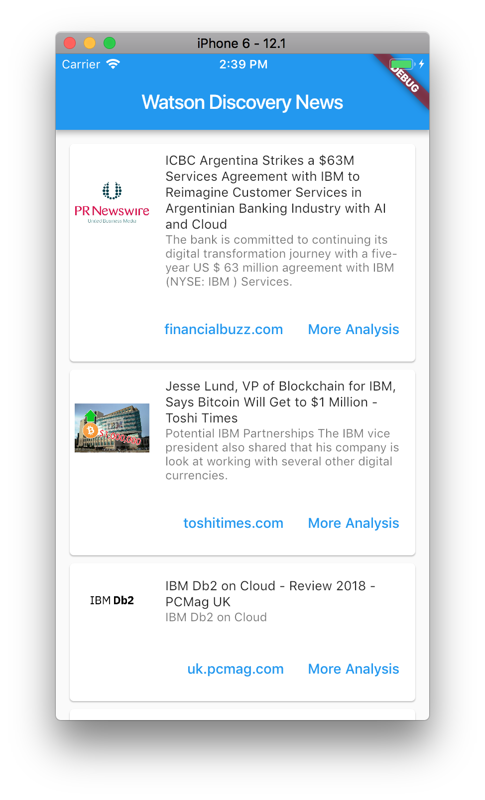
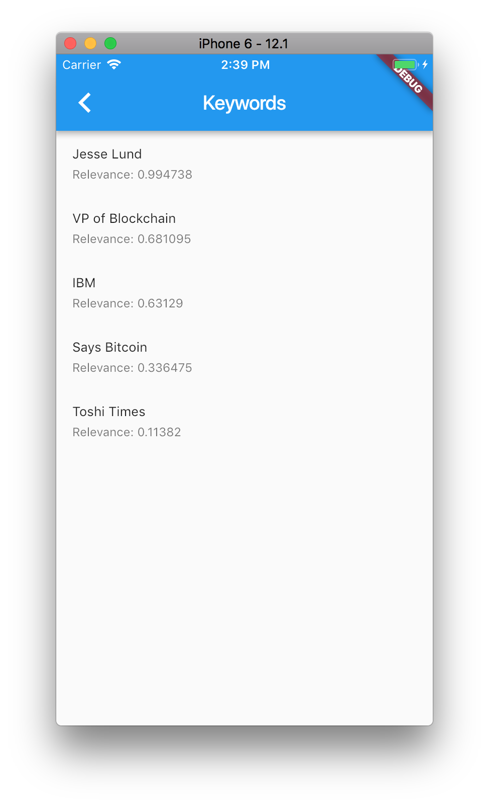
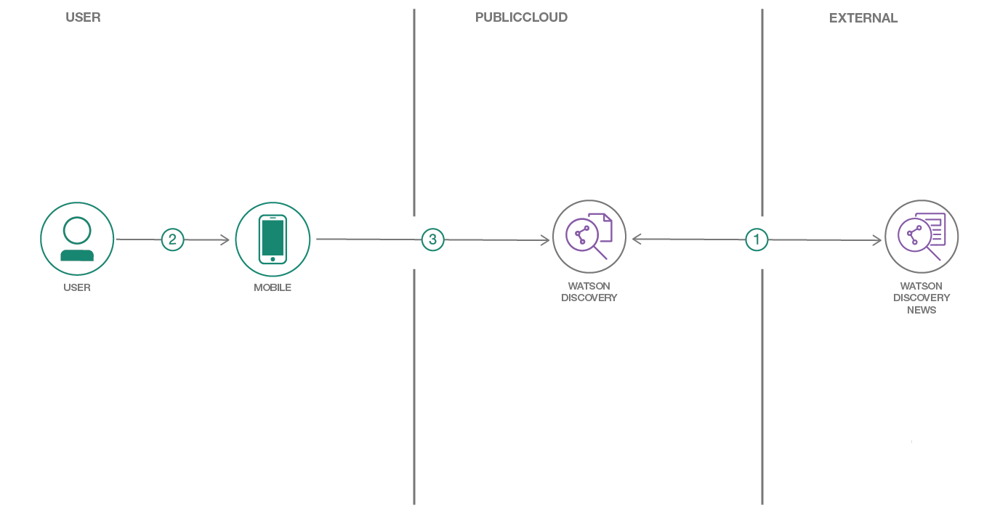
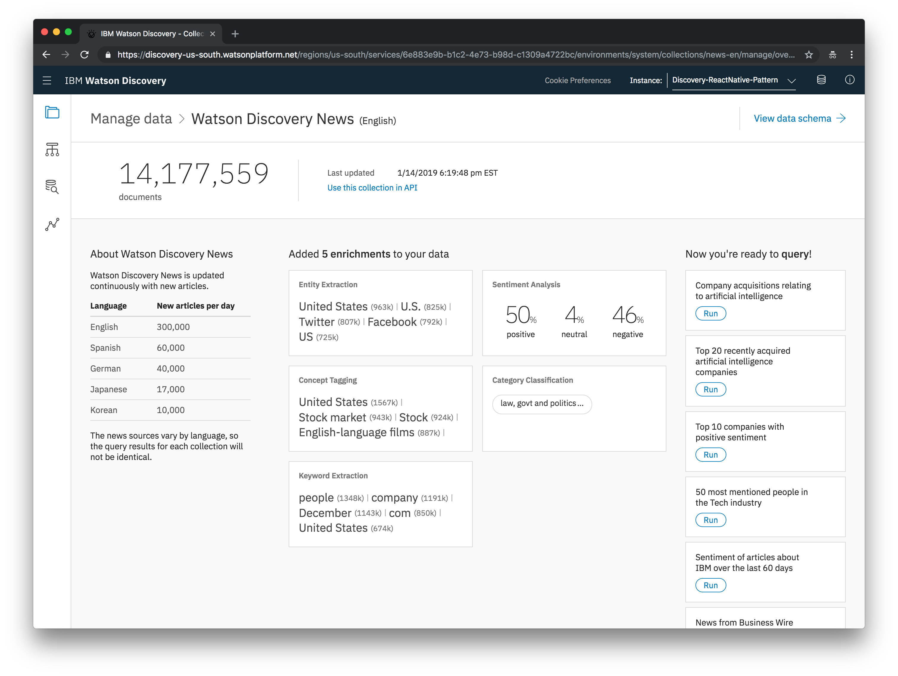
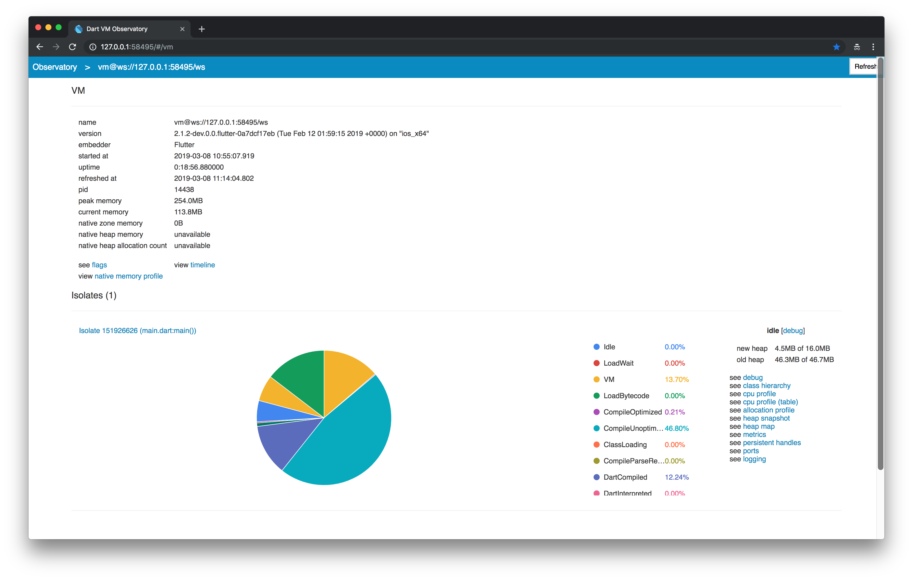

# Build a cross-platform mobile app to search company news and gain insights using Flutter and Dart

Get started building a cross-platform mobile app using [Flutter](https://flutter.dev/) to fetch news on a company and gain insights using IBM Watson Discovery.

Create a cross-platform mobile app that fetches news for a specific company. The application uses IBM Watson Discovery to get news articles with keywords. This application is easily customizable and provides a starting point to use Watson Discovery in your own Flutter applications.

Following completion of this tutorial, the developer will understand how to:

* Create a cross-platform mobile application using Flutter
* Use Watson Discovery to detect keywords for articles

|   |   |
| - | - |
|  |  |



## Flow

1. Watson News data is loaded into the Watson Discovery service collection.
1. The user interacts with the Watson Discovery service via the Flutter mobile app UI running in the Xcode iOS Simulator.
1. The initial load of the mobile app will pull up recent, relevant articles for a company. The user can then click on insights to get keywords from Watson Discovery for any specific article.

## Included components

* [IBM Watson Discovery](https://www.ibm.com/watson/developercloud/discovery.html): A cognitive search and content analytics engine for applications to identify patterns, trends, and actionable insights. Extract meta-data from returned content such as concepts, keywords, and sentiment using natural language understanding.

## Featured technologies

* [Flutter](https://flutter.dev/): Flutter lets you build cross-platform mobile apps using the [Dart](https://www.dartlang.org/) programming language.

# Steps

> NOTE: This app requires that the following steps be performed on a Mac running the latest iOS version.

1. [Clone the repo](#1-clone-the-repo)
1. [Create IBM Cloud services](#2-create-ibm-cloud-services)
1. [Configure credentials](#3-configure-credentials)
1. [Run the application](#4-run-the-application)

## 1. Clone the repo

```bash
git clone https://github.ibm.com/tmarkiewicz/flutter_watson_discovery
cd flutter_watson_discovery
```

>For an overview of the project structure, including the Flutter assets, please check out [DEVELOPING.md](DEVELOPING.md).

## 2. Create IBM Cloud services

* [**Watson Discovery**](https://cloud.ibm.com/catalog/services/discovery)

## 3. Configure credentials

Launch the **Watson Discovery** tool. The credentials for the service can be found by selecting the `Service Credentials` tab.

If no credentials exist, select the `New Credential` button to create a new set of credentials.

In the `main.dart` file, add the `apikey` value to the `basicAuth` variable using the following format: `'apikey:<your api key>'`.

## 4. Run the application

The app must be run using the Xcode iOS Simulator.

* Install the [Flutter](https://flutter.dev/docs/get-started/install/macos) SDK.
* Install [Xcode](https://developer.apple.com/xcode/) using the `App Store` on your Mac.

Start the iOS Simulator.

Build and run the app using the following command:

```bash
flutter run
```

The `flutter run` command performs two main steps:

* It builds the required set-up files for your iOS Flutter app.
* It launches the application on the `Xcode iOS Simulator`.

The task is successfully complete once you see `Xcode build done.` in the console.

# Sample Output

Your `iOS Simulator` screen should look similar to this:


For each article found by Watson Discovery, you will see a title, a description, a link to some Discovery insights, and a link to the website that hosted the article.

> Note: To scroll the articles list, click and drag the mouse pointer up and down.

From the main screen, if you click on **More Analysis**, you will see the following:


Here you will see the `keywords` associated with the article, as well the relevance score from Watson Discovery.

> Note: Click [here](https://www.ibm.com/cloud/garage/architectures/cognitiveDiscoveryDomain/overview) for more information about these enrichments generated by Watson Discovery.

From the main screen, if you click on the web site link, the article will be displayed:


# Optional Steps

## Run the application on an Android virtual device

Start your Android simulator.

Run the following command to run the app in Android:

```bash
flutter run
```

This will require that you have installed either the `Android SDK` or `Android Studio` application.

## Run the application on a device

After the application is running in the iOS simulator, you can test it on an actual device. For iOS devices, see the [Flutter official documentation](https://flutter.dev/docs/get-started/install/macos#deploy-to-ios-devices) for the required steps.

## Modify the company being searched by the app

As a default, `IBM` is the company used in the search query sent to Watson Discovery. To change this, you will need to modify the hard-coded search query string defined in the file [lib/main.dart](https://github.ibm.com/tmarkiewicz/flutter_watson_discovery/blob/master/flutter_watson_discovery/lib/main.dart).

Modify the value specified in the `queryTerm` string.

```dart
static String queryTerm = 'IBM';
```

## Explore Watson Discovery News

The data being used by this mobile app comes from a `Discovery News` collection that is available to every Watson Discovery service created. To explore this data, you can use the tooling available from the [Watson Discovery](https://cloud.ibm.com/catalog/services/discovery) service panel.

Launch the **Watson Discovery** tool. Click on `Manage` tab, and then the `Launch Tool` button.

From the list of data collections, select `Watson Discovery News`. You should then see the following screen:



# Troubleshooting

* The main `articles` panel is blank (i.e. no articles displayed).

  > This may be due to forgetting to add your Watson Discovery API key, as shown in `Step 3` above. If it has been added, verify the key is valid, and that the string in the correct format (`'apikey:<your api key>'`)

## Remote Debugging

Once the `iOS Simulator` screen is displayed, you can use the [Dart Observatory](https://flutter.dev/docs/testing/debugging#dart-observatory-statement-level-single-stepping-debugger-and-profiler) debugger to monitor the application.

To view the debugger, navigate to the URL printed to console in a browser window. Your spoecific URL with port may be different, but here's an example message after running `flutter run` from the console:

`An Observatory debugger and profiler on iPhone 6 is available at: http://127.0.0.1:58359/`



For more information on running the `Xcode iOS Simulator`, from the Simulator menu bar, select `Help` > `Simulator Help`.

# Links

* [Watson Discovery Getting Started Tutorial](https://console.bluemix.net/docs/services/discovery/getting-started.html#getting-started-tutorial)
* [Watson Discovery API docs](https://console.bluemix.net/apidocs/discovery)
* [How to use Xcode iOS Simulator for responsive web testing on Mac](https://medium.com/@ali.dev/how-to-use-xcode-ios-simulator-for-responsive-web-testing-on-mac-7870ee4fc22b)

# Related resources
* [Build a cross-platform mobile app using React Native](https://ibm.biz/BdzFes)
* [Dissecting React Native](https://ibm.biz/BdzFej)

# License

This code pattern is licensed under the Apache Software License, Version 2.  Separate third party code objects invoked within this code pattern are licensed by their respective providers pursuant to their own separate licenses. Contributions are subject to the [Developer Certificate of Origin, Version 1.1 (DCO)](https://developercertificate.org/) and the [Apache Software License, Version 2](https://www.apache.org/licenses/LICENSE-2.0.txt).

[Apache Software License (ASL) FAQ](https://www.apache.org/foundation/license-faq.html#WhatDoesItMEAN)
